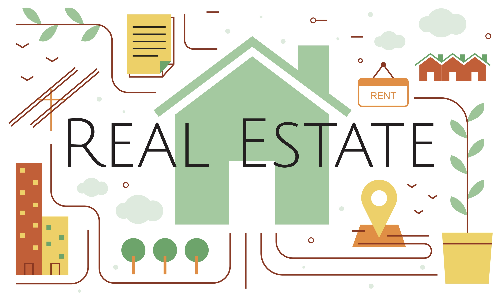

<h1>Real State Negotiation</h1>

This is a fictional project for studying purposes. The company, business context and the insights are not real. 
The dataset used in this project is from Kaggle and it is available <a href="https://www.kaggle.com/datasets/harlfoxem/housesalesprediction" target="_blank">there</a>.

<h2>1. Description of the Business Problem</h2>

The House Rocket is a real state company. They work buying houses for a good price and selling them later after some time. 
The company has a dataset that contains information about a lot of houses available to be bought. 
The data scientist from House Rocket should help the CEO answering two questions and creating two tool to help understanding the dataset.

<h3>The questions to be answered:</h3>

Which houses should the House Rocket CEO buy and at what price?
    The source code can be found <a href="https://github.com/m4theus4ndr4de/house_rocket/blob/main/house_rocket_app.py" target="_blank">here</a>
        and the dashboard is available <a href="https://house-rocket-app-ma.herokuapp.com/" target="_blank">here</a>.

When is the best time to sell them and what would be the selling price? 
    The source code can be found <a href="https://github.com/m4theus4ndr4de/house_rocket/blob/main/house_rocket_insights.ipynb" target="_blank">here</a>.

<h3>The tools to be created:</h3>

An interactive dashboard in which it is possible to filter the data according to the CEO requirements and explore more about it.

Crate a few insights about the dataset telling if they are true or false.

<h2>2. Dataset Attributes</h2>

Information about the atrributes can be found <a href="https://www.kaggle.com/harlfoxem/housesalesprediction/discussion/207885" target="_blank">here</a>.

<table style="width:100%">
<tr><th>Attribute</th><th>Description</th></tr>
<tr><td>id</td><td>Unique ID for each home sold</td></tr>
<tr><td>date</td><td>Date of the home sale</td></tr>
<tr><td>price</td><td>Price of each home sold</td></tr>
<tr><td>bedrooms</td><td>Number of bedrooms</td></tr>
<tr><td>bathrooms</td><td>Number of bathrooms, where .5 accounts for a room with a toilet but no shower</td></tr>
<tr><td>sqft_living</td><td>Square footage of the apartments interior living space</td></tr>
<tr><td>sqft_lot</td><td>Square footage of the land space</td></tr>
<tr><td>floors</td><td>Number of floors</td></tr>
<tr><td>waterfront</td><td>A dummy variable for whether the apartment was overlooking the waterfront or not</td></tr>
<tr><td>view</td><td>An index from 0 to 4 of how good the view of the property was</td></tr>
<tr><td>condition</td><td>An index from 1 to 5 on the condition of the apartment</td></tr>
<tr><td>grade</td><td>An index from 1 to 13, where 1-3 falls short of building construction and design, 
7 has an average level of construction and design, and 11-13 have a high quality level of construction and design</td></tr>
<tr><td>sqft_above</td><td>The square footage of the interior housing space that is above ground level</td></tr>
<tr><td>sqft_basement</td><td>The square footage of the interior housing space that is below ground level</td></tr>
<tr><td>yr_built</td><td>The year the house was initially built</td></tr>
<tr><td>yr_renovated</td><td>The year of the house's last renovation</td></tr>
<tr><td>zipcode</td><td>What zipcode area the house is in</td></tr>
<tr><td>lat</td><td>Lattitude of the house</td></tr>
<tr><td>long</td><td>Longitude of the house</td></tr>
<tr><td>sqft_living15</td><td>The square footage of interior housing living space for the nearest 15 neighbors</td></tr>
<tr><td>sqft_lot15</td><td>The square footage of the land lots of the nearest 15 neighbors</td></tr>
</table>

<h2>3. Business Premises</h2>

<h3>The premises that were assumed for the development of the business problem solution are:</h3>

<ul>
<li>The zipcode, condition and grade were the most important variables to decide which houses should be purchased or not. Only houses with condition 
greater than or equal to three and grade greater than or equal to seven were classified as houses to be purchased.</li>
<li>The season was considered an important variable to find the best moment to sell the house.</li>
<li>The median price was considered a better metric to evaluate if the house should be purchased because the mean value can vary considerably 
if a house in one region is priced much higher than other houses.</li>
<li>The median price per zipcode was also considered to set the selling price. Houses with a price below the median have 30% profit and houses above the median have 10% profit.</li>
<li>The price per square foot of the living area was the variable analized to buy or not the house</li>
<li>The values equal to zero in the column yr_renovated correspond to hoouses that were never renovated.</li>
<li>The price column represents the value at which the house was advertised for sale.</li>
<li>The date column represents the first day the house was for sale.</li>
</ul>

<h2>4. Solution Strategy</h2>

<ol>
<li>Download the dataset from <a href="https://www.kaggle.com/datasets/harlfoxem/housesalesprediction" target="_blank">Kaggle</a>.</li>
<li>Understand the business problem.</li>
<li>Clean, analyse and explore the dataset using data science packages in Python.</li>
<li>Answer the main questions from the business problem.</li>
<li>Develop dashboard for the CEO using Streamlit and deploy on the cloud <a href="https://house-rocket-app-ma.herokuapp.com/" target="_blank">Heroku</a>.</li>
<li>Create possible insights and analyse them.</li>
</ol>

<h2>5. The Insights</h2>

<b>I1:</b> Houses that have some kind of river, lake or sea in front of them are at least 30% more expensive than the others that don't have water in front of them.

<b>True:</b> Houses that have some kind of river, lake or sea in front of them are 212,64% more expensive.

<b>I2:</b> Houses built before 1955 are 50% cheaper.

<b>False:</b> The price of the houses that were built before and after 1955 are almost the same.

<b>I3:</b> The average price of the houses are greater in the summer than all other seasons by 10%.

<b>False:</b> The average price of the houses during the spring are greater than the summer.

<b>I4:</b> The average price increased by 10% from 2014 to 2015.

<b>False:</b> The mean price of the houses is almost the same in the two years considered.

<b>I5:</b> The difference between the lowest and highest value between the average price for the months is greater than 10 % of the maximum value.

<b>False:</b> The average price from april is a little bit less than 10% greater than the average price in february.

<b>I6:</b> Houses that were never renovated are at least 20% cheaper.

<b>True:</b> Houses that were never renovated are 30% cheaper than the others that were renovated.

<h2>6. Possible Profit of the Solution</h2>

The proposed solution would result in an average profit of 100 K per house purchased and sold.

House Rocket would get a profit of 998 M if all the houses were bought requiring an investment of 5,134 M.

<h2>7. Conclusion</h2>

The questions that motivated this project were answered. Analysing the dataset it was possible to find out which houses should be bought based on their price, zipcode, condition and grade. 
    The dashboard was created using Streamlit and deployed on <a href="https://house-rocket-app-ma.herokuapp.com/" target="_blank">Heroku</a>. The insights were generated based on the dataset from 
    <a href="https://www.kaggle.com/datasets/harlfoxem/housesalesprediction" target="_blank">Kaggle</a>.

<h2>8. Future Work</h2>

<ul>
<li>Improve Streamlit dashboard to add new features.</li>
<li>Analyse the data to find out if houses in bad condition should be bought and renovated.</li>
<li>Develop a machine learning model to predict if a certain house with known attributes should be bought or not by a given price.</li>
<li>Develop a machine learning model to predict the adequate value to sell a house the was already bought.</li>
</ul>
